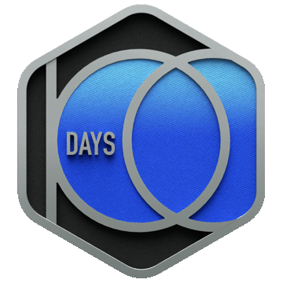

<!-- 🌌 THE HERO BANNER 🌌 -->

<!-- ⚡ NEON BOOT SEQUENCE ⚡ -->

 

<b>Independent AI Consultant | Integrated B.Tech & M.Tech (IT) @ IIPS, DAVV</b>[cite: 1] 
<i>Building scalable backend architectures & intelligent multimodal AI Agents.</i>

<!-- 🔗 COMMAND CONSOLE 🔗 -->

   

   

<!-- 🏆 ELITE PROVING GROUNDS 🏆 -->

[ 600+ DSA PROBLEMS CONQUERED | TOP 10% GLOBALLY ][cite: 1]

 

   

   

   

<!-- ⚡ CORE ARSENAL ⚡ -->

  

<!-- Corrected Icon List for Perfect Rendering -->

  

<i>Frameworks: LangChain, Streamlit, Render, Vercel</i>[cite: 1]

   

   

<!-- 🌌 AI AGENT VAULT (FULL-WIDTH CINEMATIC CARDS) 🌌 -->

  

<!-- KRISHIMITRA -->

 

Multimodal AI pipeline integrating <b>EfficientNetB0</b> and <b>Gemini Vision</b> to process image-based disease diagnosis across 27 crop categories for 1,200+ active users[cite: 1].

 

  

    

<!-- TEAMMATCH AI -->

 

Engineered an 8-dimensional <b>KNN recommendation engine</b> and K-Means clustering algorithm, achieving sub-50ms response times for dynamic teammate matching[cite: 1].

 

  

    

<!-- RESUME FORGE -->

 

AI-powered document optimization platform integrating Streamlit and Gemini APIs. Architected ATS parsing workflows to reduce response latency from 8 seconds to 2 seconds[cite: 1].

 

  

    

<!-- FIELDLENS -->

 

Automated WhatsApp-based telecom photo-validation workflow. Built an OCR pipeline using EasyOCR to extract MAC/RSN IDs, achieving 90%+ validation accuracy[cite: 1].

 

  

   
<!-- 🌊 FLUID FOOTER WAVE 🌊 -->

