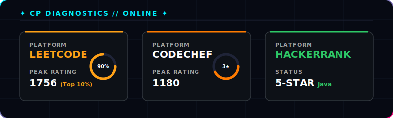
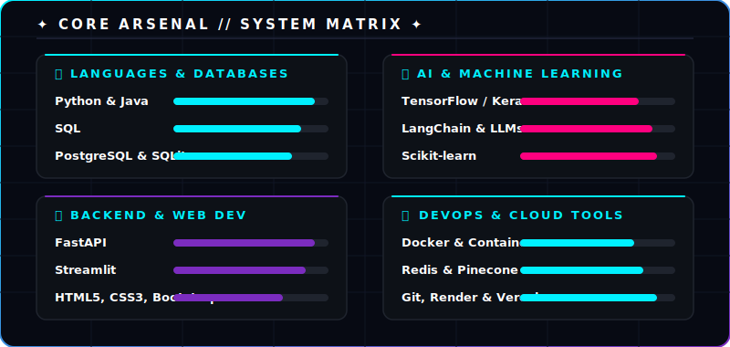
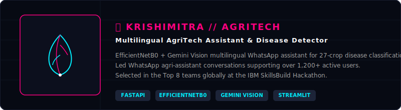
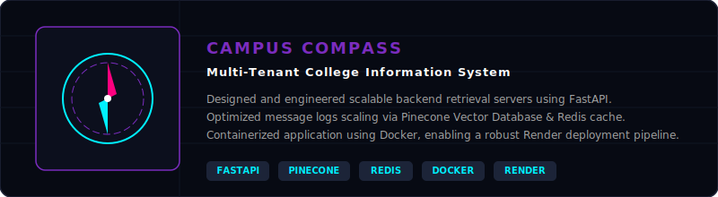

<!-- Banner Image -->

<!-- Typing SVG -->

<!-- Subtitle / Headline Info -->

  
<b>Independent AI Consultant | Integrated B.Tech & M.Tech (IT) @ IIPS, DAVV</b>

  
<i>Building scalable backend architectures & intelligent multimodal AI Agents.</i>

<!-- Social Links -->

  
  &nbsp;
  
  &nbsp;
  

<!-- Styled Divider -->

<!-- PROVING GROUNDS / COMPETITIVE PROGRAMMING -->

<!-- Custom Proving Grounds Dashboard SVG -->

  

 

<!-- GitHub Streak Widget -->

  

<!-- CORE ARSENAL / SKILLS (Rendered with the custom core-arsenal SVG tag grid) -->

  

<!-- PROFESSIONAL EXPERIENCE SECTION (Full-width stacked cards to ensure text readability) -->

  

<!-- Experience 1: Resume Forge -->

  

 

<!-- Experience 2: FieldLens -->

  

<!-- FEATURED PROJECTS SECTION (Full-width stacked cards to ensure text readability) -->

  

<!-- Project 1: KrishiMitra -->

  
  &nbsp;
  

 

<!-- Project 2: TeamMatch AI -->

  
  &nbsp;
  

 

<!-- Project 3: Campus Compass -->

  
  &nbsp;
  

  

<!-- Footer Wave Banner -->

